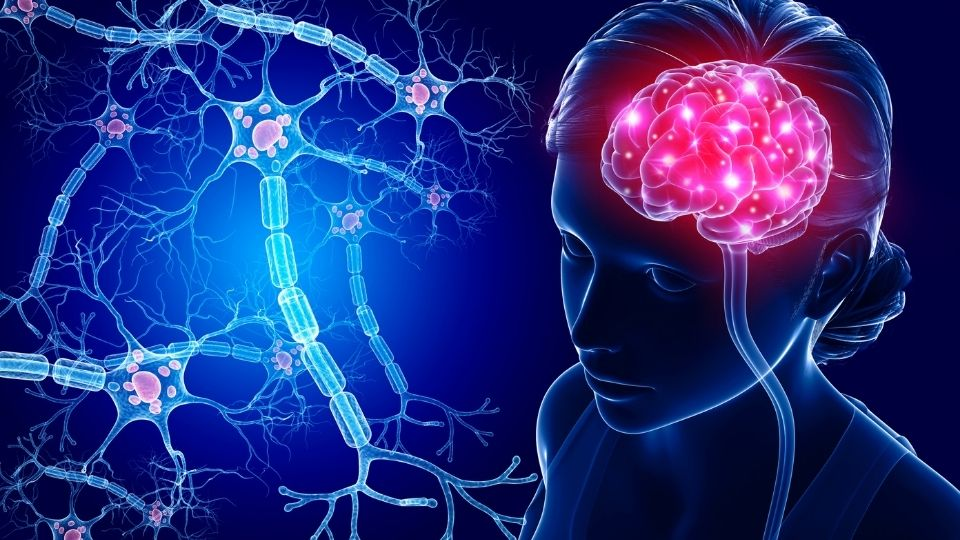

# 🧠 Brain Tumor Detection System

[](https://brain-tumor-prediction-model.onrender.com/)
[](https://python.org)
[](https://flask.palletsprojects.com)
[](https://tensorflow.org)

An AI-powered web application that uses deep learning to classify brain MRI scans and detect different types of brain tumors. This system can identify **Glioma**, **Meningioma**, **Pituitary tumors**, or classify scans as **No Tumor** with high accuracy.

## 🎯 Live Demo

**🔗 Try it now**: [https://brain-tumor-prediction-model.onrender.com/](https://brain-tumor-prediction-model.onrender.com/)



## ✨ Features

### 🏥 Medical AI Capabilities
- **4-Class Classification**: Accurately detects Glioma, Meningioma, Pituitary tumors, or No tumor
- **Real-time Analysis**: Instant MRI scan processing and results
- **Confidence Scoring**: Shows prediction confidence percentage
- **Medical Information**: Detailed information about each tumor type

### 🔧 Technical Features
- **Advanced Image Processing**: OpenCV-based preprocessing pipeline
- **Deep Learning Model**: Custom CNN trained on medical imaging data
- **Web-based Interface**: No installation required, works in any browser
- **Responsive Design**: Works on desktop, tablet, and mobile devices

## 🚀 How to Use

1. **Visit**: [https://brain-tumor-prediction-model.onrender.com/](https://brain-tumor-prediction-model.onrender.com/)
2. **Upload**: Click "Choose File" and select a brain MRI image (JPG, PNG, JPEG)
3. **Analyze**: Click "Predict" button to process the image
4. **Results**: View classification results with:
   - Tumor type detected
   - Confidence percentage
   - Medical information about the condition

## 🧬 Tumor Types Detected

| Type | Description | Common Symptoms |
|------|-------------|-----------------|
| 🔴 **Glioma** | Tumors arising from glial cells in brain/spinal cord | Headaches, seizures, memory loss |
| 🟡 **Meningioma** | Tumors from meninges (brain/spinal cord membranes) | Vision problems, hearing loss, seizures |
| 🟢 **Pituitary** | Abnormal growths in the pituitary gland | Headaches, vision loss, hormonal changes |
| ⚪ **No Tumor** | Healthy brain tissue detected | Regular checkups recommended |

## 🔬 Model Architecture

```
Input: 224×224 Grayscale MRI Image
    ↓
Preprocessing Pipeline:
- Gaussian Blur (noise reduction)
- Grayscale Conversion
- Normalization (0-1 range)
    ↓
Custom CNN Architecture:
- Convolutional Layers
- Residual Connections
- Squeeze-and-Excitation Blocks
    ↓
Output: 4-Class Probability Distribution
```

### Model Performance
- **Input Size**: 224×224 pixels
- **Color Space**: Grayscale
- **Framework**: TensorFlow/Keras
- **Model Size**: 0.59MB (optimized for deployment)

## 🛠️ Technology Stack

### Backend
- **Flask 3.0.0** - Web framework
- **TensorFlow 2.13+** - Deep learning
- **OpenCV 4.8+** - Image processing
- **NumPy 1.24+** - Numerical computing
- **Pillow 10.0+** - Image handling

### Frontend
- **HTML5** - Structure
- **CSS3** - Styling
- **JavaScript** - Interactivity
- **Responsive Design** - Mobile compatibility

### Deployment
- **Render.com** - Cloud hosting
- **Gunicorn 21.2.0** - WSGI server
- **Python 3.11.9** - Runtime environment

## 📁 Project Structure

```
Brain-Tumor-Prediction-Model/
├── app.py                 # Flask application
├── requirements.txt       # Python dependencies
├── runtime.txt           # Python version specification
├── model/
│   └── my_model.keras    # Trained model (0.59MB)
├── static/
│   ├── style.css         # Styling
│   ├── script.js         # Frontend logic
│   ├── brain.jpg         # Demo image
│   └── logo.jpg          # App logo
├── templates/
│   └── index.html        # Web interface
└── recommendation.json   # Model metadata

```

## 🔧 Local Development

### Prerequisites
- Python 3.11+
- pip package manager

### Installation

1. **Clone the repository**:
   ```bash
   git clone https://github.com/shivang-jagwan/Brain-Tumor-Prediction-Model.git
   cd Brain-Tumor-Prediction-Model
   ```

2. **Create virtual environment**:
   ```bash
   python -m venv venv
   source venv/bin/activate  # On Windows: venv\Scripts\activate
   ```

3. **Install dependencies**:
   ```bash
   pip install -r requirements.txt
   ```

4. **Run the application**:
   ```bash
   python app.py
   ```

5. **Open in browser**: http://localhost:5000

## ⚕️ Medical Disclaimer

> **⚠️ IMPORTANT**: This application is designed for **educational and research purposes only**. It should **NOT** be used as a substitute for professional medical diagnosis, treatment, or advice. 
> 
> **Always consult with qualified healthcare professionals** for any medical concerns, diagnosis, or treatment decisions. This tool is meant to demonstrate AI capabilities in medical imaging and should not influence any medical decisions.

## 📊 Model Training Information

The deep learning model was trained on a curated dataset of brain MRI images containing:
- **Glioma cases**: Various grades and subtypes
- **Meningioma cases**: Different locations and sizes  
- **Pituitary tumors**: Various adenoma types
- **Normal cases**: Healthy brain scans

Data preprocessing included:
- Image standardization (224×224 pixels)
- Noise reduction with Gaussian filtering
- Intensity normalization
- Data augmentation for robustness

## 🤝 Contributing

Contributions are welcome! Please feel free to submit issues, feature requests, or pull requests.

1. Fork the repository
2. Create a feature branch (`git checkout -b feature/improvement`)
3. Commit changes (`git commit -am 'Add new feature'`)
4. Push to branch (`git push origin feature/improvement`)
5. Create Pull Request

## 📝 License

This project is licensed under the MIT License - see the [LICENSE](LICENSE) file for details.

## 👨‍💻 Developer

**Shivang Jagwan**
- GitHub: [@shivang-jagwan](https://github.com/shivang-jagwan)
- Project: [Brain-Tumor-Prediction-Model](https://github.com/shivang-jagwan/Brain-Tumor-Prediction-Model)

---

### 🌟 Show Your Support

If you find this project helpful, please give it a ⭐️ on GitHub!

**Live Application**: [https://brain-tumor-prediction-model.onrender.com/](https://brain-tumor-prediction-model.onrender.com/)